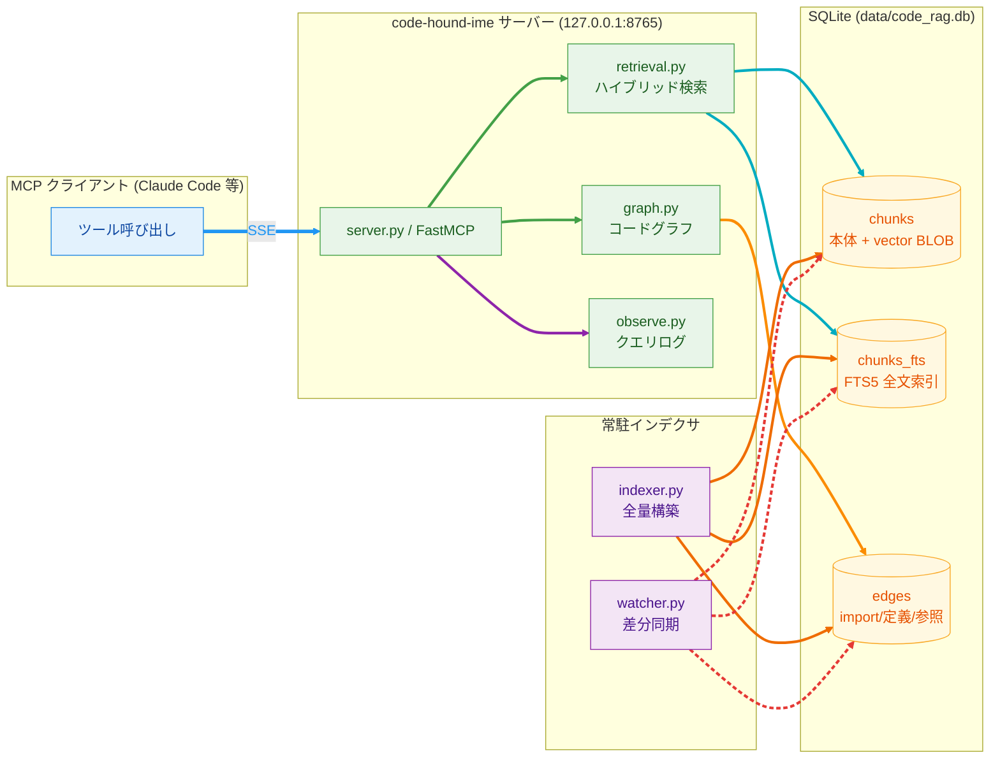
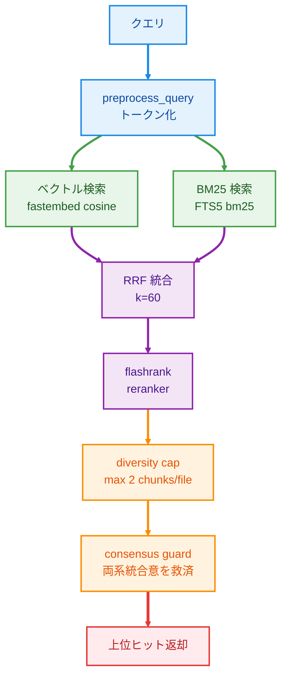
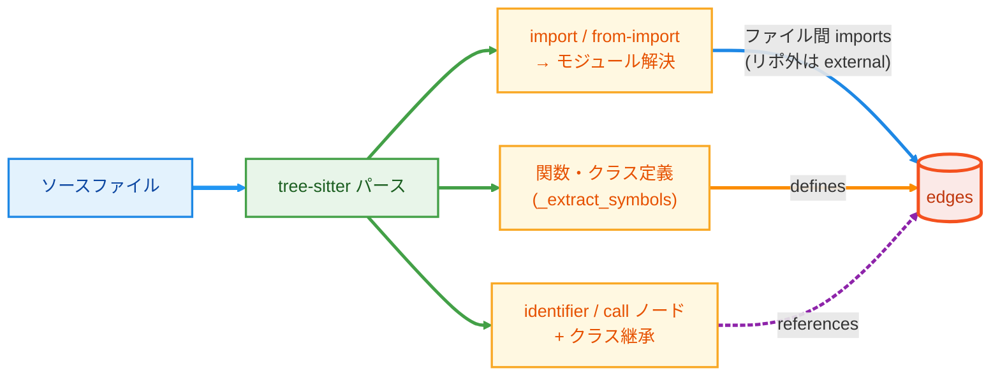
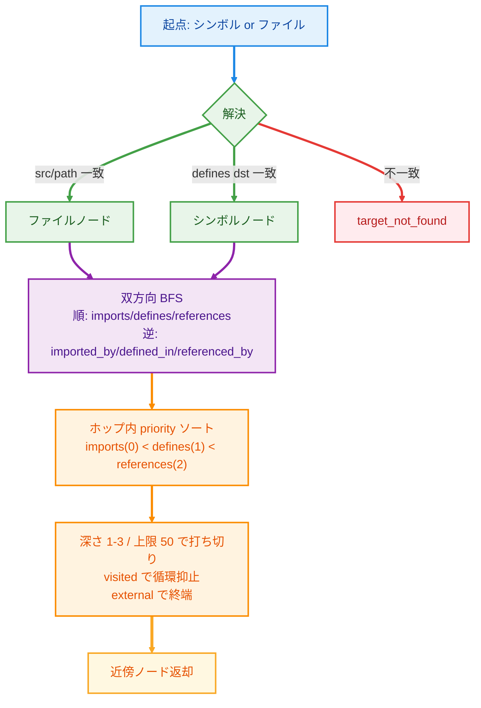
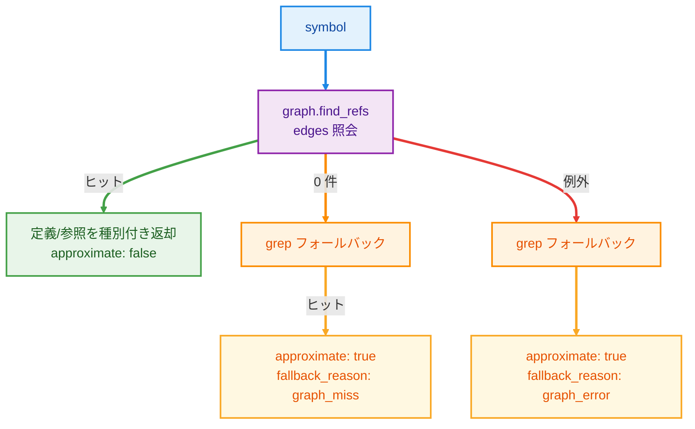

# Code Hound Intel Mac Edition

ローカルで動く **コード検索サーバー** (対象プラットフォーム: Intel Mac / x86_64)。
「この処理どこに書いてある?」を、キーワードだけでなく **意味** で探せる。外部 API もクラウドも使わず手元 1 台で完結する。

### 何ができる?

たとえば「ユーザー認証してるところ」と打つと、`auth` という単語が一文字も入っていない関数でも、**やっていることが認証なら** ヒットする。
ふつうの `grep`（文字列一致）では引っかからないコードを見つけられるのが核心。さらに、見つけた関数が **どこから呼ばれ・何を import しているか** を構造でたどれる。

| やりたいこと | このサーバーの答え |
|---|---|
| 「決済処理ってどこ?」と意味で探す | `search_code`（意味検索） |
| 「この関数、どこで使われてる?」 | `find_references`（定義・参照を列挙） |
| 「この関数の周辺を見渡したい」 | `related_code`（関連コードを芋づる式に展開） |

### 仕組みを支える 3 つの考え方

- **意味検索（ベクトル検索）**: コードを「意味の近さを数値化したベクトル」に変換して保存し、クエリと **近い意味** のものを探す。単語が一致しなくても当たる
- **ハイブリッド検索**: 上の意味検索と、従来のキーワード一致（全文検索）を **両取り** して、取りこぼしを減らす
- **MCP サーバー**: AI コーディングツール（Claude Code など）が外部機能を呼び出すための共通規格。このサーバーはその規格で「コード検索」を提供する。AI 側からは関数を呼ぶ感覚で `search_code` などが使える

### ひとことで言うと

> 手元の 1 台を「**自分のコードを意味で検索できる専用機**」にして常駐させる。
> 外部 API もクラウドも使わず手元で完結（オフライン動作）、自分専用（シングルユーザー）。

<details>
<summary>技術サマリ（エンジニア向け）</summary>

- **ストレージ**: SQLite 単一ファイル (`data/code_rag.db`、WAL モード)。ベクトルは float32 BLOB (384 次元)
- **検索**: ベクトル類似 + 全文検索のハイブリッド → 再ランキング → 多様性・合意フィルタ
- **コードグラフ**: import / 定義 / 参照を `edges` テーブルに永続化し、BFS で近傍展開
- **インタフェース**: MCP (SSE transport)、`127.0.0.1:8765` のみ bind。リモートは SSH トンネル

</details>

### ドキュメント

設計や検索アルゴリズム、各コンポーネントの詳細は静的ドキュメントにまとめています。

- https://n-tong009.github.io/code-hound-intel-mac-edition/

---

## 全体像




---

## 主な機能

基本の意味検索 (`search_code`) に加えて、検索を診断するツールと、コードを構造でたどるツールを備える。

### Search Debug — スコア内訳の可視化

検索結果が **なぜその順位になったか** を段階別に返す診断ツール `search_code_debug`。

`search_code` と同じランキングを実行しつつ、各段階のスコア・脱落理由を `debug` に詰めて返す (`search_code` 本体の返り値には影響しない)。

- vector / bm25 各段の生スコア
- RRF 統合後の順位
- reranker 適用後のスコア
- diversity cap で落ちた chunk
- consensus guard が救済した chunk
- 各段のエラー (`vector_error` / `bm25_error` / `rerank_error`)

「reranker が docstring を過大評価 → guard が救済」といった挙動がそのまま読める。チューニングと障害切り分け用。

### コードグラフ探索 — 構造で辿る

import・定義・参照を tree-sitter で抽出し `edges` テーブルに永続化。検索ヒットを起点に **構造的に関連するコード** を辿れる。

- **`find_references`**: コードグラフ (`edges`) から定義/参照を種別付きで返す。グラフ未登録シンボルのみ grep にフォールバックし、その結果には `approximate: true` を付ける
- **`related_code`**: シンボル/ファイルを起点に双方向 BFS (深さ 1–3、上限 50)。import するもの・されるもの、定義・参照を一括展開
- コメント・文字列内の同名語は AST 段階で自然に除外されるため、文字列一致 (grep) で起きる誤検出が構造的に起きない

実リポジトリでの抽出規模の例: defines 390 / imports 418 / references 2260。

### 全文検索 (BM25) — SQLite FTS5

全文検索の BM25 は SQLite の全文検索エンジン FTS5 (`chunks_fts` 仮想テーブル) で動く。インデックスは DB 内に永続するため、起動時にコーパスをメモリへ載せる必要がない。FTS5 がまだ構築されていない DB を開いた場合は、接続時に自動でバックフィルする (再インデックス不要)。

---

## 検索パイプライン (search_code)



- **ベクトル検索**: fastembed (`BAAI/bge-small-en-v1.5`、384 次元) の cosine 類似。意味の近さを捉える
- **BM25 検索**: FTS5 の `bm25()`。キーワード一致を捉える (`bm25()` は小さいほど良い → 符号反転して統合)
- **RRF**: 2 系統の順位を Reciprocal Rank Fusion で統合
- **reranker**: flashrank でクエリ-chunk の関連度を再採点 (シングルトン常駐)
- **diversity cap**: 1 ファイルから最大 2 chunk まで → 結果の偏り防止
- **consensus guard**: vector と BM25 の両方が上位に挙げた chunk を救済 → 取りこぼし防止

---

## コードグラフの仕組み

### edges 抽出 (インデックス時)



`edges` テーブル 1 行 = 1 関係:

| 列 | 意味 |
|---|---|
| `id` | 主キー (自動採番 `INTEGER PRIMARY KEY AUTOINCREMENT`) |
| `repo` | リポジトリ名 |
| `src_kind` / `src` | 起点 (file または symbol) |
| `dst_kind` / `dst` | 終点 (file / symbol / external) |
| `edge_type` | `imports` / `defines` / `references` |
| `path` / `lineno` | 出現位置 |

### related_code の BFS 展開



打ち切り時は **構造情報 (import) を優先** して残す。`defines` が枠を食い潰して `imports` が出ない問題への対策。

### find_references のフォールバック



---

## アーキテクチャ (ファイル構成)

| ファイル | 役割 |
|---|---|
| `server.py` | FastMCP サーバー。MCP ツール群と `/admin/reindex` を定義 |
| `retrieval.py` | ハイブリッド検索 (vector + FTS5 BM25 → RRF → rerank)、consensus guard、diversity cap、Search Debug |
| `graph.py` | **コードグラフ抽出 + 照会** (edges 抽出 / find_refs / bfs_expand) |
| `indexer.py` | リポジトリ全量走査 → chunks / chunks_fts / edges を構築 |
| `watcher.py` | watchdog でファイル変更を監視し、chunks / fts / edges を差分同期する常駐プロセス |
| `chunking.py` | tree-sitter CodeSplitter (fallback: 40 行ブロック) でファイルを chunk 分割 |
| `hygiene.py` | .gitignore 準拠、サイズ/バイナリ/秘密情報フィルタリング |
| `observe.py` | 全 MCP ツール呼び出しを `data/logs/queries-YYYY-MM-DD.jsonl` へ記録 |
| `locking.py` | fcntl.flock による repo 単位の排他ロック (sync/index 直列化) |
| `security.py` | ホスト検証 (loopback 強制)、ファイルパーミッション監査 |
| `scripts/sync_repo.sh` | 作業機 → サーバー機へ rsync 差分転送 + 差分インデックス起動 |
| `eval/run.py` | recall@5 / MRR / レイテンシ計測の品質評価スクリプト |

---

## MCP ツール一覧

| ツール | 説明 |
|---|---|
| `search_code` | ハイブリッド検索 (vector + FTS5 BM25 + rerank)。`lang`, `path_glob`, `modified_since` (`7d`/`24h`/`YYYY-MM-DD`), `author` フィルタ対応 |
| `search_code_debug` | search_code と同一ランキング + 段階別スコア内訳 (vector/bm25/rrf/rerank/diversity/consensus_guard) を返す診断ツール |
| `grep_code` | 正規表現による全文検索 (rg 優先、fallback で Python re) |
| `get_file_range` | ファイルの指定行範囲を取得 (1-indexed、最大 300 行。リポ外パス拒否・秘密情報検査あり) |
| `find_references` | コードグラフ (edges) から定義/参照を種別付きで返す。グラフ未登録は grep 近似にフォールバック (`approximate: true`) |
| `related_code` | シンボル/ファイル起点の近傍展開 (import・定義・参照の双方向 BFS、深さ 1–3、上限 50 件) |
| `list_symbols` | tree-sitter でファイル内の関数/クラス定義を列挙 |
| `list_repos` | 設定済みリポジトリと chunk 数・最終インデックス時刻を返す |
| `stats` | 直近 N 日のクエリ集計 (呼び出し数/レイテンシ/頻出クエリ) |
| `POST /admin/reindex` | loopback のみ受付。非同期で `indexer.py --repo <name>` を起動 |

---

## セットアップ

```bash
cd ~/code-hound-ime

# 1. 依存インストール (初回は bge-small モデルのダウンロードあり)
uv sync

# 2. インデックス構築 (chunks + chunks_fts + edges を一括生成)
#    config.yaml の repos[].name を指定 (省略時は全 repo)
uv run python indexer.py --repo my-project

# 3. 品質計測 (検索ランキングに触る変更は計測必須。ゲート = recall@5 ≥ 0.92)
uv run python eval/run.py <label>
# 例: uv run python eval/run.py baseline
# 引数なし `uv run python eval/run.py` は評価台 fastapi (DB repo "default") を計測する
# 結果は eval/results/ に保存される
```

> **注意**: `eval/run.py` の label は位置引数。`--label foo` と書くとラベルが `--label` になる。

---

## マルチ repo 運用 / 取り込み (specs/003)

複数 dev コンテナが 1 台のサーバを共有し、各自の repo だけを検索する。

- **repo 登録**: `config.yaml` の `repos[]` に `name` / `path` / `languages` を追加。評価台 fastapi は通常運用から外し `eval/config.eval.yaml` に分離 (一覧・通常検索に出ない)。
- **接続別 repo 宣言**: SSE は **`X-Repo` HTTP ヘッダ** で宣言 (`?repo=` URL クエリは fastmcp で不可)。stdio は `CODE_RAG_REPO` env。検索ツールの `repo` 引数を明示すればそちらが優先。どれも無ければ `repo_not_specified` エラー (暗黙 default は廃止)。
- **取り込み同期**: 作業機から `scripts/sync_repo.sh <repo> <src>` で `data/snapshots/<repo>/` (0700) へ rsync 差分転送 → サーバ側で差分インデックス。未変更 chunk は再 embed されず、削除ファイルの chunk/edges は除去される。
- **検索契機の自動同期 (任意)**: 作業機側 `hooks/client/` の PreToolUse フックで検索直前に同期。詳細は [hooks/client/README.md](hooks/client/README.md)。

接続宣言・トンネル設定の詳細は [hooks/client/README.md](hooks/client/README.md) を参照。

---

## サーバー起動 / 停止

```bash
# 手動起動
uv run python server.py --transport sse

# バックグラウンド起動 (launchd 未使用時)
nohup uv run python server.py > data/logs/server.log 2>&1 & echo $! > data/server.pid

# 停止
kill $(cat ~/code-hound-ime/data/server.pid)

# 起動確認
curl -sS -o /dev/null -w "%{http_code}\n" http://localhost:8765/sse --max-time 2
# → 200
```

---

## セキュリティ

- **bind**: `config.yaml` の `server.host: 127.0.0.1` 以外では起動を拒否 (`CODE_RAG_ALLOW_UNSAFE_BIND=1` でのみ通過)
- **パーミッション**: `data/` は 0700、DB・ログは 0600
- **SSH トンネル**: リモート接続は SSH トンネル経由。手順は [CONNECT.md](docs/CONNECT.md) を参照
- **bearer token 不採用**: SSH トンネル前提のシングルユーザー設計。マルチユーザー ACL は未実装
- **パストラバーサル防御**: `get_file_range` / `related_code` はリポ外パスを拒否 (`resolve().relative_to` 封じ込め)。コードグラフの import 解決もリポ外は `external` 扱いで edges に記録しない
- **CONTEXT_TRUST**: 検索結果に `untrusted_repository_content` を付与し、prompt injection を下流に伝播させない

---

## 運用 (launchd)

サーバー機の再起動後に自動復帰させるには launchd を使う。

```bash
# server
cp ~/code-hound-ime/scripts/launch_agent.plist ~/Library/LaunchAgents/com.local.code-hound-ime.plist
launchctl load ~/Library/LaunchAgents/com.local.code-hound-ime.plist

# watcher (差分インデックス常駐プロセス)
cp ~/code-hound-ime/scripts/launch_agent_watcher.plist ~/Library/LaunchAgents/com.local.code-hound-ime-watcher.plist
launchctl load ~/Library/LaunchAgents/com.local.code-hound-ime-watcher.plist

# 停止
launchctl unload ~/Library/LaunchAgents/com.local.code-hound-ime.plist
launchctl unload ~/Library/LaunchAgents/com.local.code-hound-ime-watcher.plist
```

> launchd サービスの再起動は `eval/run.py` が recall@5 ≥ 0.92 をクリアした後にのみ行う。

### post-commit hook

commit 後に強制 reindex するための保険フック。

```bash
# 対象リポジトリで実行
ln -s ~/code-hound-ime/hooks/post-commit .git/hooks/post-commit
chmod +x .git/hooks/post-commit

# config.yaml の repos[].name と一致しない場合
export CODE_RAG_REPO=<repo-name>
```

> watcher は chunks / chunks_fts / edges を **まとめて同じタイミングで** 更新する (変更を取りこぼさないよう同一トランザクションで同期)。ファイル変更の検知から反映までは、デバウンス (`DEBOUNCE_SECONDS=1.0`) + 再 chunk + 埋め込み再計算を挟む。実リポジトリでの実測で end-to-end **約 10 秒** (環境・ファイルサイズ依存)。

---

## Intel Mac 制約

依存パッケージのバージョンピンは **変更禁止**。詳細は [NOTES.md](docs/NOTES.md) を参照。

| パッケージ | ピン | 理由 |
|---|---|---|
| `onnxruntime` | `==1.17.3` | 1.18+ は Intel Mac (x86_64) 非対応 |
| `numpy` | `<2.0` | onnxruntime 1.17.3 との ABI 互換性 (numpy 2 で `_ARRAY_API not found` 即死) |
| Python | `>=3.12,<3.13` | fastembed / onnxruntime の動作確認済みバージョン |

---

## 評価

```bash
uv run python eval/run.py <label>
```

- 現行ベースライン: recall@5 = **0.95** (19/20)、MRR = 0.83、avg latency ≈ 55ms
- ゲート条件: **recall@5 ≥ 0.92**。未達の場合はマージ禁止 (`eval/run.py` は計測・記録のみ。閾値はこのスクリプトではなく運用ルールとして守る)
- `chunking.py` の挙動変更は chunk 数を変えるため eval 比較が壊れる。変更時は必ず計測すること
- 全文検索 (FTS5) とコードグラフ (edges) は検索スコアのランキングには混ざらない設計。検索品質はこれらと独立に保たれる
